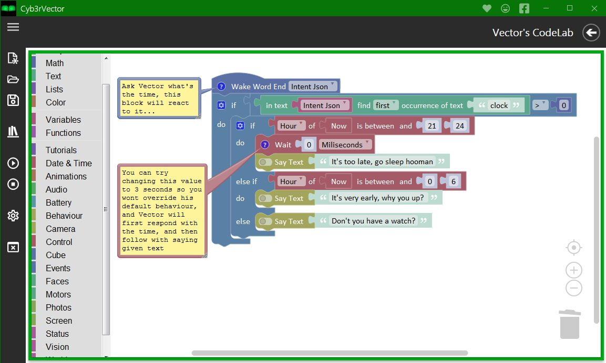
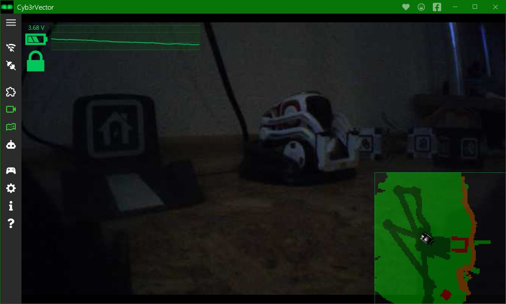
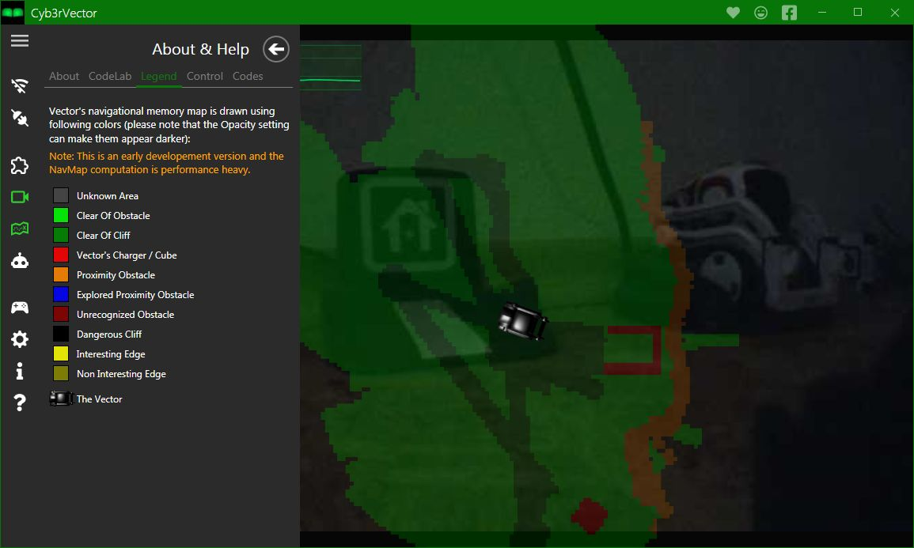
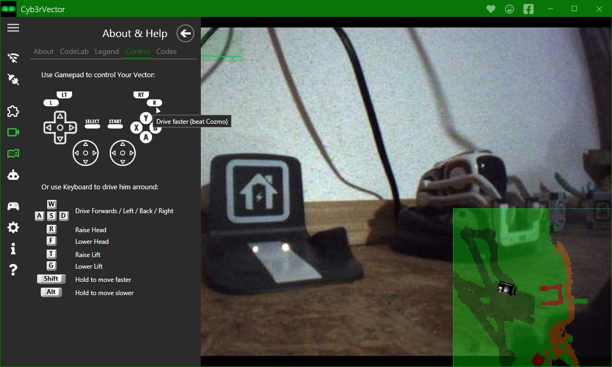

---
layout: default
---

# Welcome to Cyb3rVector's CodeLab Project

The ultimate goal of this Project is to finish this educational Application to enable anyone to use the **Vector's SDK** even without the technical background or programming skills.
Main instrument to achieve this goal is called **Vector's CodeLab** - a Blockly based coding enviroment which allows executing various commands through creating a simple programs by stacking graphical blocks together.
This **CodeLab enviroment** and **Vector Robot** combined creates an ideal platform for young to develop their skills and love towards technology and robotics.
I want this software to be available to anyone for free of charge, as I believe the education should be fun, playful and free.

# FEATURES

List of some of the highlighted Cyb3rVector features is available [**here**](./features.html)

# FREQUENTLY ASKED QUESTIONS

Visit the project's [GitHub Discussions](https://github.com/cyb3rdog/Cyb3rVector/discussions/categories/q-a) section for the answers to most frequently asked questions.

# GALLERY

Take a look at some screenshots from the application:

{::options parse_block_html="true" /}

{::options parse_block_html="false" /}
[{: .thumbnail_img}](./screenshots.html)
[{: .thumbnail_img}](./screenshots.html)
[{: .thumbnail_img}](./screenshots.html)
[{: .thumbnail_img}](./screenshots.html)
{::options parse_block_html="true" /}

{::options parse_block_html="false" /}

# ROADMAP

This document describes the milestones of the Cyb3rVector project:
- All completed roadmap milestones are marked with: ✔️
- Unfinished roadmap milestones are marked with:   🏁

## Phase I. - Cyb3rVector

Goal of this phase is to design the application to be intuitive, simple enough, fun and educational, allowing everyone to develop their technical and coding skills, through pure enjoyment of the Play with the Vector robot.

### Roadmap of Phase I.

#### Application features:
- ✔️ &nbsp; Build an Application Core
- ✔️ &nbsp; Implement the Vector SDK
- ✔️ &nbsp; Vector's Camera stream feed
- ✔️ &nbsp; Drive Vector with Keyboard
- ✔️ &nbsp; Drive Vector with Ganepads/Controllers
- ✔️ &nbsp; Vector's Command List
- ✔️ &nbsp; Vector's Settings and Lifetime Stats
- ✔️ &nbsp; Head-Up-Display Battery stats and History
- ✔️ &nbsp; Vector's Navigation Map and Minimap
- ✔️ &nbsp; Application Updater
- ✔️ &nbsp; Help and Knowledge Base
- ✔️ &nbsp; Feedback submition form
- ✔️ &nbsp; Release of first public-alpha version
- ✔️ &nbsp; Support for EscapePod Vector's
- ✔️ &nbsp; Anki account management
- ✔️ &nbsp; Look for Testers in public audiences
- ✔️ &nbsp; Known faces management
- ✔️ &nbsp; Alexa onboarding support
- ✔️ &nbsp; Multiplatform code base
- ✔️ &nbsp; Firwmare update feature
- ✔️ &nbsp; Escape pod extension proxy and plugin
- 🏁 ***Collection of Error and Debug logs from testers***
- 🏁 ***Release a Beta Version***
- 🏁 ***Release the final Version***

#### Vector's Codelab:
- ✔️ &nbsp; Custom Blocks support
- ✔️ &nbsp; Fully dynamic Generator of Blocks
- ✔️ &nbsp; Fully dynamic interpetter of generated Blocks
- ✔️ &nbsp; Sequential Block programs support
- ✔️ &nbsp; Event-based Block programs support
- ✔️ &nbsp; Multithreading (more block programs at a time)
- ✔️ &nbsp; Full coverage of Vector SDK features
- ✔️ &nbsp; Library of Templates and Demos
- ✔️ &nbsp; Simple and Advanced modes
- ✔️ &nbsp; Multi-language support
- ✔️ &nbsp; Special fields for Slider,Angle,Date and Time
- ✔️ &nbsp; Additional Blocks (FileSystem, WebAPI,...)
- ✔️ &nbsp; Escape Pod Extension block for reacting to any phrase
- 🏁 ***In-app translation utilities***
- 🏁 ***Translate lang files to various world languages***
- 🏁 ***Community-made blocks: API for external modules***
- 🏁 ***Community-made blocks: Support for Addons/Plugins***
- 🏁 ***Find and license custom animations***
- 🏁 ***Head-less execution mode (run block programs in background)***
- 🏁 ***Background programs Task Manager and Scheduler***
- 🏁 ***Community Library: Sharing Block programs via the Server***
- 🏁 ***Rating system for Blocks programs made by other users***

#### Backend Infrastructure:
- ✔️ &nbsp; Get Server and Public domain
- ✔️ &nbsp; Server site for Downloads
- ✔️ &nbsp; Server site for Feedbacks
- 🏁 &nbsp; ***Public Website***
- 🏁 &nbsp; ***Cover the Server costs***

## Phase II. - Cyb3rVector's Online Codelab

Main Goal of this phase is to Port the CodeLab to platform independent Web environment hosted on own servers and Create tools for people to connect their Vectors to this Web Site.

- ✔️ &nbsp; Proof of concept tests and trials [(online CodeLab demo)](./codelab.html)
- 🏁 &nbsp; ***Vector SDK/API adjusment***
- 🏁 &nbsp; ***Server backend interpretter for existing Vector blocks***
- 🏁 &nbsp; ***Server site CodeLab Enviroment***
- 🏁 &nbsp; ***Server Proxy for connecting Vectors to the Web enviroment***
- 🏁 &nbsp; ***Client Proxy applications with Vector connection configurator***
- 🏁 &nbsp; ***Client Proxy Builds for Windows, Mac, Linux***
- 🏁 &nbsp; ***Client Proxy apps Built for Android and Iphone***

## Phase III. - Cyb3rVector's Codelab Software

This stage will focus on creating a specific version of Vector's CodeLab which will be hosted directly from Vector, allowing the users to login to Vector's CodeLab hosted on Vector's firmware from any device in the local network.

- 🏁 &nbsp; ***Obtaining OSKR***
- 🏁 &nbsp; ***Creating CodeLab port to run directly from Vector***
- 🏁 &nbsp; ***Deploying the CodeLab port to OSKR Software***
- 🏁 &nbsp; ***Extending the Software and CodeLab capabilities***

# OTHER VECTOR PROJECTS

Here are the other Vector related projects I am working on:

- [Vector Pyhton SDK](https://github.com/cyb3rdog/vector-python-sdk) - the only python SDK with support for EscapePod and OSKR robots.
- [Vector Node.js SDK](https://github.com/cyb3rdog/anki-vector-nodejs)
- [Vector GO SDK](https://github.com/cyb3rdog/vector-go-sdk)
- [EscapePod Extensions](https://github.com/cyb3rdog/escape-pod-extension)
- [EscapePod Docker Image](https://github.com/cyb3rdog/escapepod-docker)

## Just a word before you go...
I have made Cyb3rVector available to everyone for free of charge, and I need Your help to keep it that way.
I am dedicating all my free time to this project, and it already brought some costs with it. Yet, as you can see, there is still plenty of work ahead and more expenses are yet to come.

That's why I need you, a passionate Vector owners, who will join me on this adventure and help me make this dream come true.
There are some exclusive Rewards waiting for you on the Patreon page, so make sure you don't miss them :) Stay tuned and thanks for your support :)



Sincere Thanks!

Gratefully yours,
Cyb3rdog
