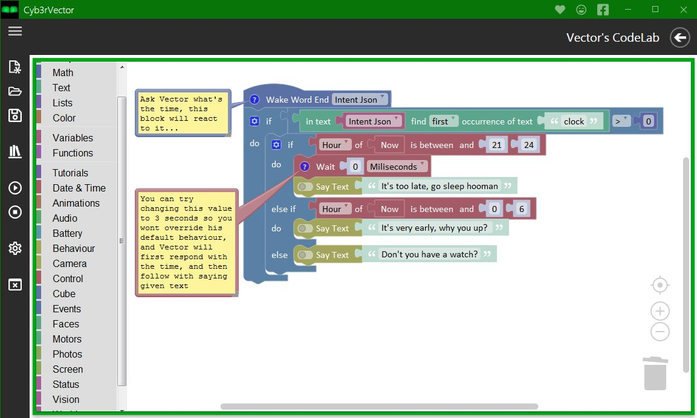
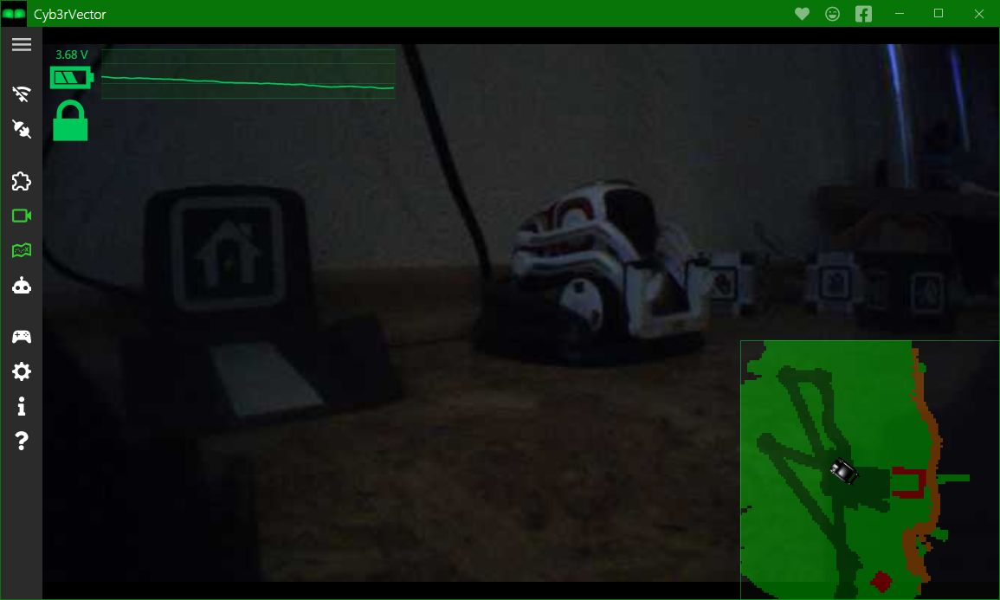

### Screenshots from Cyb3rVector application

This screen displays how the CodeLab looks like in the application:

{::options parse_block_html="true" /}

{::options parse_block_html="false" /}
{: .greater_image}
{::options parse_block_html="true" /}

{::options parse_block_html="false" /}

This picture displays an overview of the main application screen, with Main Menu on the left,
HeadUpDisplay Overlay of Battery status and History and Navigation map displayed as Minimap:

{::options parse_block_html="true" /}

{::options parse_block_html="false" /}
{: .greater_image}
{::options parse_block_html="true" /}

{::options parse_block_html="false" /}

This picture displays Navigation map displayed on fullscreen with a legend to it available from Help:

{::options parse_block_html="true" /}

{::options parse_block_html="false" /}
{: .greater_image}
{::options parse_block_html="true" /}

{::options parse_block_html="false" /}

This screenshot shows the info on how the Gamepad controller actions are mapped:

{::options parse_block_html="true" /}

{::options parse_block_html="false" /}
{: .greater_image}
{::options parse_block_html="true" /}

{::options parse_block_html="false" /}

This screenshot shows the deployment process for the extension made specially for EscapePod robots.
(Regular Vector's can still fully use the application, only this specific option will not be visible for them)

{::options parse_block_html="true" /}

{::options parse_block_html="false" /}
{: .greater_image}
{::options parse_block_html="true" /}

{::options parse_block_html="false" /}

This screenshot shows EscapePod Extension feature for reacting to any given keywords or phrases.
(Regular Vector's won't have this "OnKeywordHeard" block, but they can still use the "OnVoiceCommand" and react to all default voice commands)

{::options parse_block_html="true" /}

{::options parse_block_html="false" /}
{: .greater_image}
{::options parse_block_html="true" /}

{::options parse_block_html="false" /}

[Go Back](./){: .btn}{: .btn-primary}